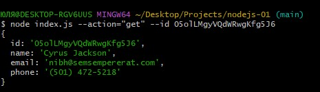

# nodejs-01

<h1>Home work Node.js</h1>

<h3>List of all contacts</h3>

<h3>Contact that we find by id</h3>

<h3>Contact that we add</h3>

<h3>Contact that we remove</h3>

<h3>List of all contacts after action</h3>

